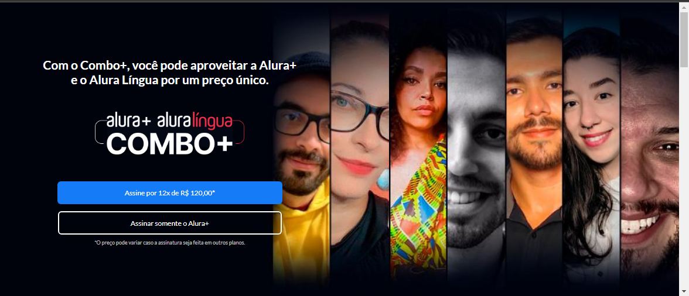
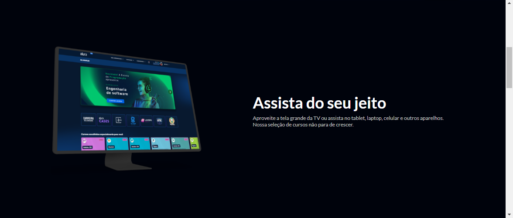
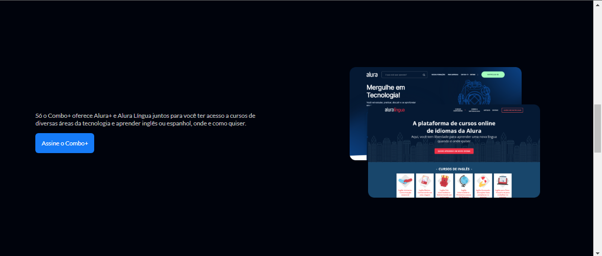
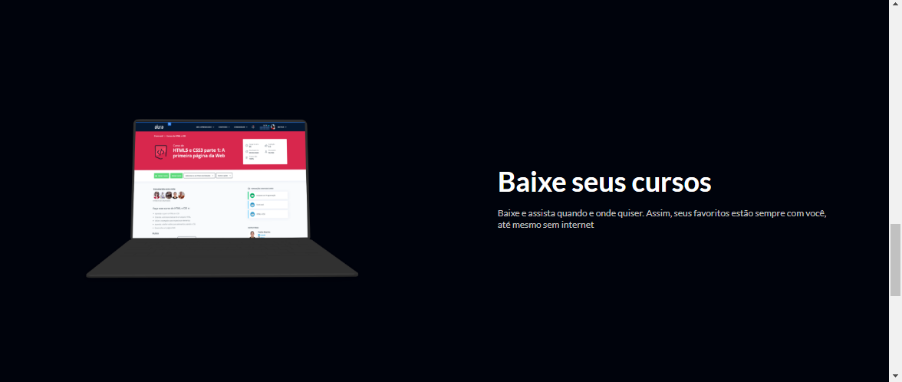
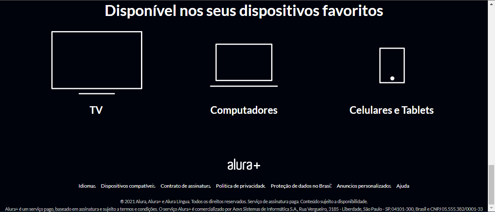

# 💻 Alura Plus

## 🖥 Layout

## 📖 Description 

    Projeto de uma landing page do curso de HTML5 e CSS da Alura onde foram utilizados imagens para divulgação dos produtos e links para direcionar os visitantes para páginas de matrícula dos cursos. 

Link do deploy -> https://alura-plus-project-delta.vercel.app/

## 📚 Tecnologias

 - HTML5
 - CSS

## 👨‍🎓 Colaborador

[David Bennet]()
